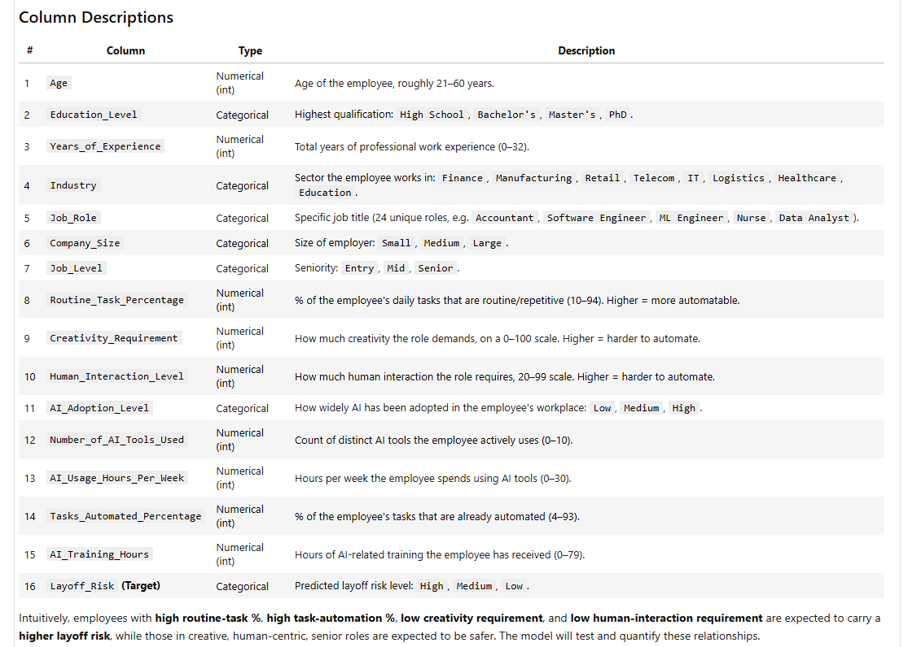
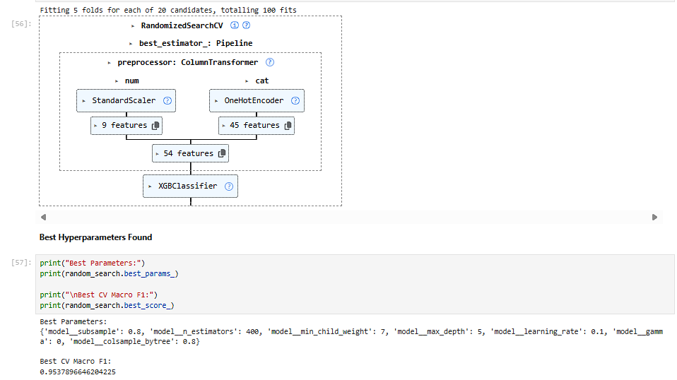
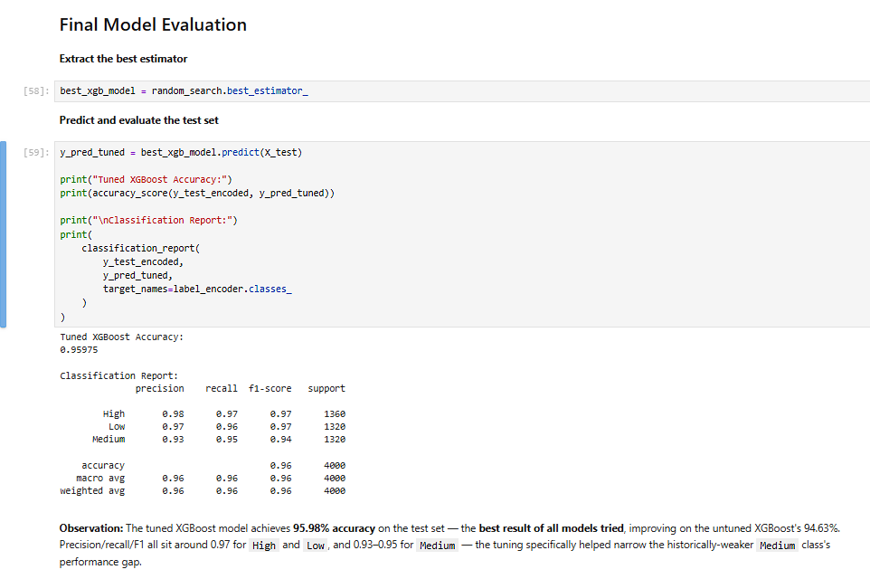
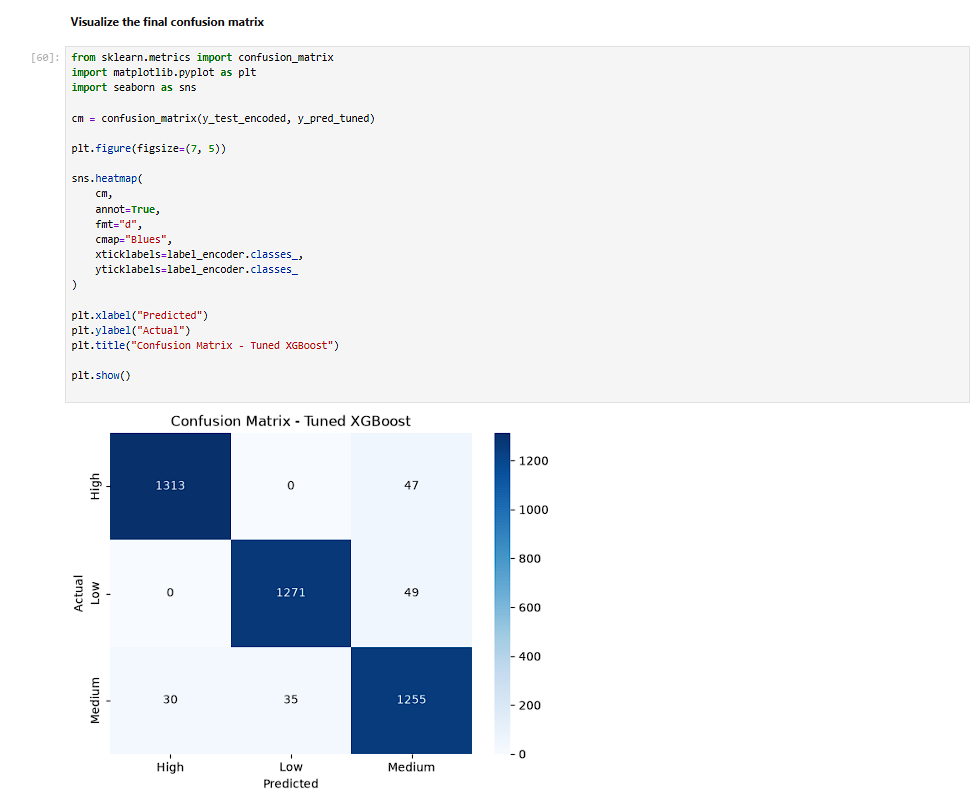
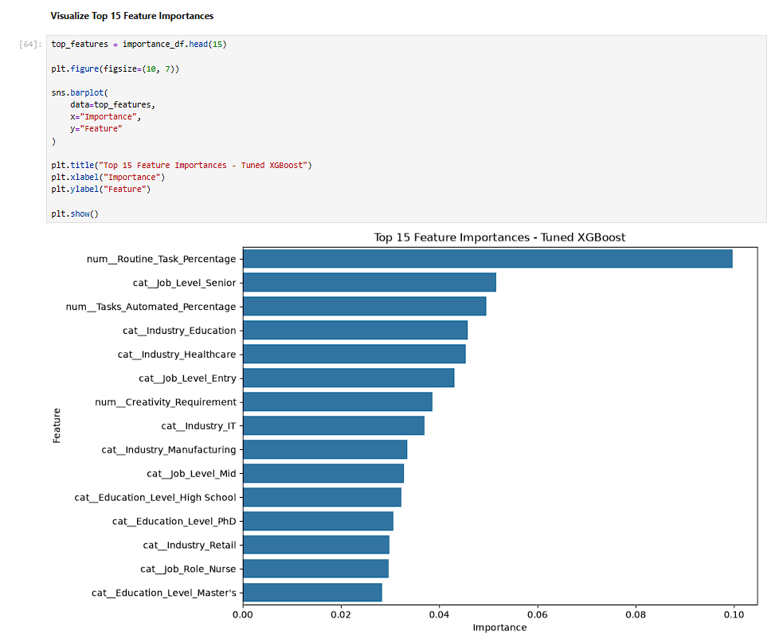

# 🤖 AI Impact on Jobs — Layoff Risk Prediction

<p align="center">
  <h1 align="center">AI Impact on Jobs — Layoff Risk Prediction</h1>
  <p align="center">
    <b>Machine Learning Classification Project</b><br>
    Predicting Layoff Risk as <b>Low</b>, <b>Medium</b>, or <b>High</b> using job and automation-related features.
  </p>
</p>

<p align="center">
  
  
  
  
  
</p>

---

## 🧠 At a Glance

| Project | Details |
|---|---|
| **Problem Type** | Multiclass Classification |
| **Target** | `Layoff_Risk` |
| **Classes** | Low, Medium, High |
| **Final Model** | Tuned XGBoost |
| **Test Accuracy** | **95.98%** |
| **CV Strategy** | 5-Fold Cross-Validation |
| **CV Metric** | Macro F1 |
| **Mean CV Macro F1** | **≈ 93.97%** |
| **Main Focus** | AI/Automation impact on jobs |

---

# 📌 1. Project Overview

Artificial Intelligence and automation are changing the way organizations perform tasks and structure jobs.

This project explores whether machine learning can use **job characteristics, automation exposure, industry, job level, and related workforce features** to classify the potential **layoff risk category** of a job.

The model predicts one of three categories:

🟢 **Low Risk**  
🟡 **Medium Risk**  
🔴 **High Risk**

### Core Question

> **Can machine learning identify patterns in job and automation-related data that help classify layoff risk?**

### Project Pipeline

```text
Dataset
   ↓
Data Understanding
   ↓
Exploratory Data Analysis
   ↓
Data Preprocessing
   ↓
Feature Preparation
   ↓
Multiple ML Models
   ↓
Model Evaluation
   ↓
Hyperparameter Tuning
   ↓
Tuned XGBoost
   ↓
Final Evaluation
   ↓
Feature Importance
```

---

# 🎯 2. Objectives

The main objectives of this project are:

- Understand the dataset and its job-related features.
- Analyze the distribution of the `Layoff_Risk` target.
- Prepare the data for machine learning.
- Train multiple classification algorithms.
- Evaluate model performance.
- Optimize XGBoost using hyperparameter tuning.
- Analyze the final model using a confusion matrix.
- Identify important features influencing model predictions.

---

# 📊 3. Dataset Understanding

The dataset contains job and workforce-related information used to predict the `Layoff_Risk` category.

### Target Variable

| Value | Meaning |
|---|---|
| `Low` | Lower predicted layoff-risk category |
| `Medium` | Moderate predicted layoff-risk category |
| `High` | Higher predicted layoff-risk category |

### Important Feature Examples

The model uses job/automation-related variables including:

- `Routine_Task_Percentage`
- `Tasks_Automated_Percentage`
- `Job_Level`
- `Industry`
- Other available job/workforce characteristics

### Target Distribution

The three target classes are approximately balanced:

| Layoff Risk | Share |
|---|---:|
| High | **33.98%** |
| Low | **33.01%** |
| Medium | **33.01%** |

---

# 🔎 4. Dataset Description

The following visualization provides a direct view of the dataset's column-level information.



**What this tells you:**  
This screenshot helps understand what information is available in the dataset before applying machine learning.

---

# 🧪 5. Machine Learning Approach

The project follows a standard supervised machine learning classification workflow.

### Step 1 — Data Understanding
Understand the dataset, columns, target variable, and feature types.

### Step 2 — Data Preparation
Prepare the dataset and features for model training.

### Step 3 — Model Training
Train multiple classification algorithms.

### Step 4 — Evaluation
Compare predictions using classification metrics such as:

- Accuracy
- Precision
- Recall
- F1-score
- Confusion Matrix

### Step 5 — Hyperparameter Tuning
Optimize XGBoost using `RandomizedSearchCV` with 5-fold cross-validation and Macro F1 as the scoring metric.

### Step 6 — Final Model
Evaluate the tuned XGBoost model on the test data.

---

# 🤖 6. Models Tested

The following classification algorithms were evaluated:

| Algorithm | Accuracy |
|---|---:|
| Decision Tree | 83.98% |
| Random Forest | 90.38% |
| Gradient Boosting | 91.33% |
| Logistic Regression | 93.78% |
| SVM (RBF) | 94.58% |
| XGBoost | 94.63% |
| **Tuned XGBoost** | **95.98%** |
| KNN | 81.20% |
| AdaBoost | 77.70% |
| Naive Bayes | 69.68% |

> The accuracy values above are the results recorded in the project notebook.

---

# ⚙️ 7. Hyperparameter Tuning

The XGBoost model was further optimized instead of relying only on its default configuration.

### Tuning Process

```text
XGBoost
   ↓
Define Parameter Search Space
   ↓
RandomizedSearchCV
   ↓
5-Fold Cross-Validation
   ↓
Macro F1 Evaluation
   ↓
Best Parameters
   ↓
Tuned XGBoost
```

The recorded cross-validation Macro F1 scores had a mean of approximately **93.97%**.



**What this tells you:**  
The screenshot shows the optimization stage used to search for a better XGBoost configuration.

---

# 🏆 8. Final Model Result

After hyperparameter tuning, the final XGBoost model achieved:

## **95.98% Test Accuracy**

The final evaluation also reports class-wise:

- Precision
- Recall
- F1-score
- Support



### Final Model

**Tuned XGBoost Classifier**

### Why this stage matters

The final result shows how the optimized model performs on the test data after the training and tuning workflow.

---

# 📉 9. Confusion Matrix

The confusion matrix provides a class-by-class view of the model's predictions.

It helps identify:

- Correct classifications
- Low → Medium/High errors
- Medium → Low/High errors
- High → Low/Medium errors



**What this tells you:**  
Instead of looking only at one accuracy number, the confusion matrix shows where the model is making classification errors.

---

# 🔍 10. Feature Importance

Feature importance helps understand which input variables contributed strongly to the trained XGBoost model.

Important features in the recorded model output include:

- `Routine_Task_Percentage`
- `Job_Level_Senior`
- `Tasks_Automated_Percentage`
- Industry-related features



### Key Observation

`Routine_Task_Percentage` appears among the prominent features in the model's feature-importance output.

**Interpretation:**  
The model is using patterns related to routine work, automation, job level, and industry when making its predictions.

> Feature importance indicates the contribution/usefulness of variables within this trained model; it does not by itself prove that a feature causes layoffs.

---

# 📈 11. Key Results

### 🏆 Final Accuracy

**95.98%**

### 🔄 Cross-Validation

**5-Fold CV**

### 📊 Mean CV Macro F1

**≈ 93.97%**

### 🎯 Prediction Classes

**Low | Medium | High**

### 🔎 Important Feature

**Routine Task Percentage** appears among the prominent features.

---

# 🛠️ 12. Technology Stack

| Technology | Used For |
|---|---|
| 🐍 Python | Core development |
| 🐼 Pandas | Data manipulation |
| 🔢 NumPy | Numerical operations |
| 📊 Matplotlib | Visualization |
| 🎨 Seaborn | Visualization |
| 🤖 Scikit-learn | ML algorithms, preprocessing & evaluation |
| 🚀 XGBoost | Final classification model |
| 📓 Jupyter Notebook | Model development & experimentation |

---

# 📂 13. Repository Structure

```text
AI-Impact-Jobs-Layoff-Risk/
│
├── 📄 ai-impact-jobs-layoff-risk-dataset.csv
├── 📓 ProjectML_classification.ipynb
├── 📑 AI_Impact_Jobs_Layoff_Risk_Final_Updated.docx
├── 📊 AI Impact on Jobs Professional 20 Slide Presentation
│
├── 🖼️ 01_column_description.png
├── 🖼️ 02_hyperparameter_tuning.png
├── 🖼️ 03_tuned_xgboost_result.png
├── 🖼️ 04_confusion_matrix.png
├── 🖼️ 05_feature_importance.png
│
└── 📘 README.md
```

---

# 🚀 14. How to Run

### Clone the repository

```bash
git clone <YOUR_GITHUB_REPOSITORY_URL>
cd AI-Impact-Jobs-Layoff-Risk
```

### Install dependencies

```bash
pip install pandas numpy matplotlib seaborn scikit-learn xgboost jupyter
```

### Start Jupyter Notebook

```bash
jupyter notebook
```

Open:

```text
ProjectML_classification.ipynb
```

Run the notebook cells sequentially to reproduce the analysis and model results.

---

# 📚 15. Project Files

### 📓 Jupyter Notebook
Contains the complete machine learning implementation, analysis, training, evaluation, and tuning.

### 📊 Dataset
Contains the data used for the classification task.

### 📑 Project Report
Provides detailed project documentation and explanation.

### 📽️ Project Presentation
Provides a presentation-based explanation of the project.

### 🖼️ Visual Results
Important model and analysis outputs are displayed directly in this README.

---

# 💡 16. Key Insights

### 1️⃣ Layoff risk can be formulated as a multiclass problem
The project classifies jobs into **Low, Medium, and High** layoff-risk categories.

### 2️⃣ Multiple ML algorithms were evaluated
The project does not depend on a single algorithm; several classification approaches were tested.

### 3️⃣ Hyperparameter tuning was applied
XGBoost was optimized using `RandomizedSearchCV` and 5-fold cross-validation.

### 4️⃣ The tuned XGBoost model achieved 95.98% test accuracy
This was the recorded final test result in the project notebook.

### 5️⃣ Automation-related features matter to the trained model
Variables such as routine-task percentage and tasks-automated percentage appear among the important features.

---

# ⚠️ 17. Important Note

This project is an **academic machine learning analysis**.

A prediction of `High`, `Medium`, or `Low` risk should **not** be interpreted as a guaranteed prediction that a particular employee or job will be laid off.

Model performance depends on:

- Dataset quality
- Dataset representativeness
- Feature quality
- Training methodology
- Test data
- Assumptions used during data preparation

Therefore, the results should be treated as **data-driven model outputs**, not certainty about real-world employment outcomes.

---

# 🔮 18. Future Scope

Possible extensions include:

- 🌐 Build an interactive prediction dashboard.
- 🧠 Add Explainable AI using SHAP.
- 📊 Add probability/confidence analysis.
- 📅 Introduce time-series workforce data.
- 🌍 Validate the model on external real-world datasets.
- 🤖 Compare additional ensemble and boosting algorithms.
- 🔄 Monitor model performance as new data becomes available.

---

# 👨‍💻 19. Author

### **Kumkum Lohiya
**

🎓 B.Tech — Computer Science Engineering  
🏫 Techno NJR Institute of Technology  
📅 Expected Graduation — 2027

---

# ⭐ Final Summary

> **AI Impact on Jobs — Layoff Risk Prediction** combines data analysis, machine learning classification, model evaluation, hyperparameter tuning, and feature-importance analysis to explore patterns associated with job layoff risk.

### The project in one line:

**Job & Automation Data → ML Classification → Tuned XGBoost → 95.98% Test Accuracy → Layoff Risk Prediction**

---

<p align="center">
  <b>📊 Data → 🤖 Machine Learning → 🔍 Insights</b>
</p>

<p align="center">
  <i>Built as an academic project to explore the relationship between AI/automation-related job characteristics and layoff-risk classification.</i>
</p>
